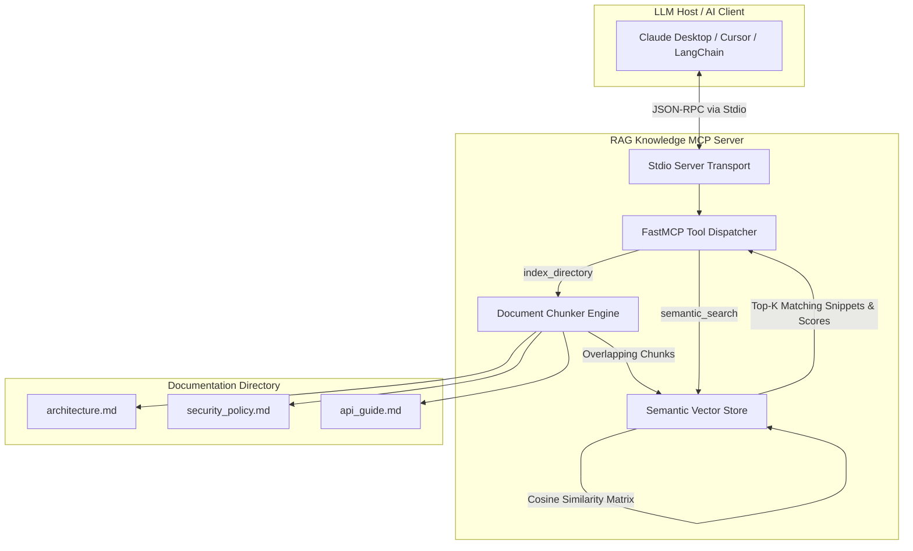

# 🧠 Semantic Knowledge Retriever (RAG) MCP Server

[](LICENSE)
[](https://www.python.org/downloads/)
[](https://modelcontextprotocol.io)
[](https://scikit-learn.org/)

A production-grade **Retrieval-Augmented Generation (RAG)** Model Context Protocol (MCP) server that indexes documentation directories (`.md`, `.txt`, `.rst`) into a vector space and exposes **semantic similarity search** tools to Large Language Models (LLMs).

---

## 📽️ System Architecture



---

## 💡 Real-World Use Case

When AI coding assistants need knowledge about private company engineering wikis, security compliance standards, or microservice architecture specs:
* **Context Overload**: Copying entire folders of documentation into LLM prompt windows exceeds context limits and dilutes output quality.
* **Exact Keyword Search Fails**: Traditional grep/keyword searching misses queries that use different terminology (e.g. searching for `"auth"` misses `"OpenID Connect"` or `"JWT bearer tokens"`).

### How This Server Solves Knowledge Retrieval
1. **Automated Sliding-Window Chunking**: Splits markdown and text files into overlapping text segments with source metadata (`file_name`, `file_path`, `chunk_id`).
2. **Vector Space Indexing**: Embeds text chunks into a term vector space using n-gram TF-IDF and computes cosine similarity matrices.
3. **Instant Pre-seeded Knowledge**: Ships with a sample engineering wiki (`sample_docs/`) so you can test semantic search right away.

---

## 🧰 Available MCP Tools

This server exposes **3 tools** over standard I/O (stdio) transport:

### 1. `index_directory`
Scans a target folder containing Markdown or text files, chunks them, and indexes them into the vector space.
* **Parameters**:
  - `target_dir` *(string, default: `"./sample_docs"`)*: Folder path to ingest.

### 2. `semantic_search`
Performs vector similarity search against indexed document chunks.
* **Parameters**:
  - `query` *(string, required)*: Natural language query or concept.
  - `top_k` *(integer, default: `3`)*: Number of top relevant matching chunks to return.

### 3. `get_kb_stats`
Returns knowledge base metrics (total chunks, unique files, vocabulary size).

---

## 📦 Installation & Quickstart

### Prerequisites
* Python 3.10 or higher
* Git

### Step-by-Step Setup

```bash
# 1. Clone the repository
git clone https://github.com/jdbruh18/rag-knowledge-mcp-server.git
cd rag-knowledge-mcp-server

# 2. Create and activate virtual environment
python -m venv venv

# On Windows (PowerShell):
.\venv\Scripts\activate

# On Linux / macOS:
source venv/bin/activate

# 3. Install package & dependencies
pip install -e .
```

---

## ⚙️ Configuration (Claude Desktop / Cursor)

### Claude Desktop Integration

Add to your `claude_desktop_config.json`:
* **Windows**: `%APPDATA%\Claude\claude_desktop_config.json`
* **macOS**: `~/Library/Application Support/Claude/claude_desktop_config.json`

```json
{
  "mcpServers": {
    "rag-knowledge": {
      "command": "D:/Projects/rag-knowledge-mcp-server/venv/Scripts/python.exe",
      "args": [
        "-m",
        "rag_knowledge_mcp.server"
      ]
    }
  }
}
```

---

## 🧪 Testing & Verification

Run the test suite to verify document chunking and vector space semantic search:

```bash
python -m pytest -o pythonpath=src
```

### Expected Output
```text
============================= test session starts =============================
platform win32 -- Python 3.11.1, pytest-9.1.1, pluggy-1.6.0
collected 3 items

tests\test_rag.py ...                                                    [100%]

============================== 3 passed in 0.22s ==============================
```

---

## 🤖 Example Prompts to Try with Your LLM

1. **Architecture Query**:
   > *"Perform a semantic search in the knowledge base for 'database caching and message queues' and summarize the platform stack."*

2. **Security & Compliance Search**:
   > *"Use `semantic_search` to find out what data encryption standards and key management guidelines are required."*

3. **API Rate Limit Search**:
   > *"What are the rate limit policies per IP address for external REST endpoints?"*

---

## 📄 License

Distributed under the **MIT License**. See [`LICENSE`](LICENSE) for details.
